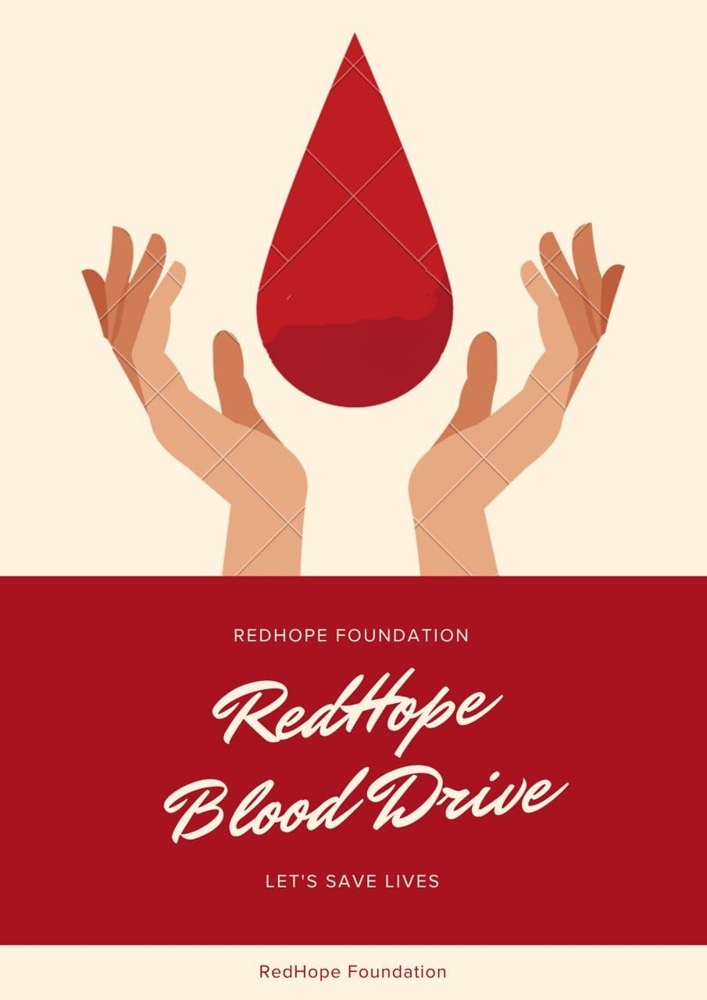

# Blood Donation Application



## 🔹 Description
The **Blood Donation Application** is a user-friendly platform designed to connect blood donors with recipients efficiently, promoting a seamless and effective donation process.  
It supports **role-based login** to provide different access levels for donors, admins, and other users.  

**Live Demo:** [Click here](https://blood-donation-auth-bb887.web.app/)

---

## 🛠 Technologies Used
- **Frontend:** React, JavaScript, React Router, Tailwind CSS  
- **Backend:** Node.js, Express.js  
- **Database:** MongoDB  
- **Authentication & Authorization:** Firebase Authentication, Role-based access control  
- **Other:** TanStack Query for data fetching and state management  

---

## ⚡ Core Features
- **Role-Based Login:** Different access for donors, admins, and users  
- User registration and profile management  
- Create and manage blood donation requests  
- Donor management dashboard (admin)  
- Content management for donation campaigns and announcements  
- Search for donors by blood group and location  
- Responsive design for desktop and mobile  
- Real-time data updates using TanStack Query  

---

## ⚙ Dependencies
- react, react-dom, react-router-dom  
- firebase  
- @tanstack/react-query  
- axios  
- express  
- mongoose  
- cors  
- dotenv  
- nodemon (for development)

---

## 🚀 How to Run Locally

1. **Clone the repository**
```bash
git clone https://github.com/obayed324/blood-donation-client.git